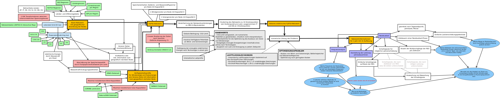

# Res_aut: non renewable residual load in a highly renewable electricity network in Austria 
> repo for Master-thesis

## Setup
- Set up conda-environment (in folder with `environment.yml`)
  - environment.yml includes all python packages
  - environment_with_specs.yml includes specifications and concrete package versions on top
```bash
conda env create -f environment.yml
```


- Install Solver (eg. Gurobi-Solver with free academic licence)
- retrieve databundle (in folder `pypsa-eur`)
~~~
cp config.default.yaml config.yaml
snakemake -j 1 results/networks/elec_s_11_ec_lcopt_Co2L-1H.nc
~~~
This basis only needs to be downloaded once, after this run, one can change `retrieve databundle` to false in `config.yml`.

## Model setup
Sets up a PsPSA-eur Network for basic energy network calculations for Austria including Austria and its neighbouring countries.

> Descriptions and all Workflow-Informations can be found in the jupyter-notebooks in "Dokument/Workflow". 

Adapted pypsa-eur Scripts:
- cluter network.py
- prepare_network.py
- solve_network.py
- _helpers.py

### Workflow 

